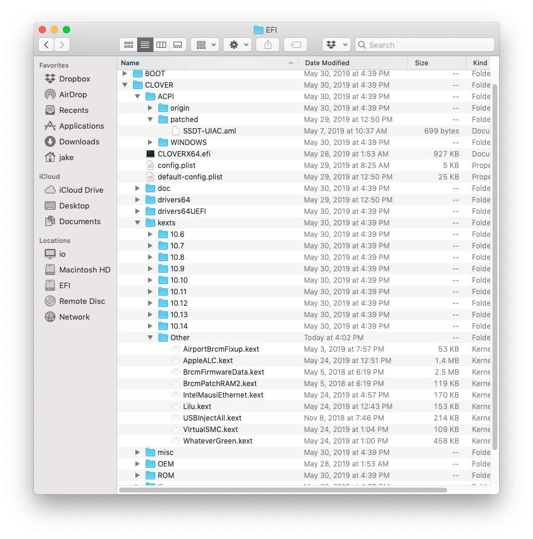

# My 2019 Hackintosh Build Guide

⚠️ This is currently a work-in-progress and it is incomplete. ⚠️

## Introduction
This document is not a step-by-step guide. Rather, it augments [Corpnewt’s  Vanilla Desktop Guide](https://hackintosh.gitbook.io/-r-hackintosh-vanilla-desktop-guide/) with hardware-specific tweaks.

My goal was to have an unmolested, vanilla macOS install with SIP enabled -- and so far, I have succeeded.

I have voluntarily reinstalled my macOS install several times to get practiced and test and document things. I publish this document to help others in my shoes. Feel free to ask me questions [on Twitter](https://twitter.com/codejake), but make sure you've read corpnewt's guide, have some clue, and have already diligently Googled.

If you spot any errors or typos, let me know.

## Warning
You will run into roadblocks. And everyone will give you their advice. Most of it is *awful*. The hackintosh world is full of people that don't know what they are doing, but are all-too-eager to dish out advice and even error-ridden corrections. Stay away from Unibeast, Multibeast, Tonymacx86.com, random people, etc.

Do keep things as vanilla as possible. Make minimal changes from the default installation. Do not put any kexts or files in `/S/L/E`, `/L/E`, etc. Everything can go into your EFI partition. *Make sure you understand the changes you are making*.

## Hardware Build
* Here is my exact build on [PCPartPicker](https://pcpartpicker.com/list/MCX2Cb).

* Intel i7-8700K CPU
* Sapphire RX 580 Nitro+ SE GPU
* ASUS Z390-I Gaming motherboard
* Samsung 970 EVO Plus NVMe SSD
* Fractal Design Define Nano S mini-ITX case
* Dell DW1560 Wi-F/Bluetooth Card ()

## Pre-installation

### (Optional) Swap out the Wi-Fi/Bluetooth Card

Your motherboard comes with a very small Wi-Fi/Bluetooth m.2 card. It's a great card that works wonderfully in Windows 10. However, there are currently no macOS drivers for it. Your best option is the Dell DW 1560 Wi-Fi/Bluetooth card. You do not need any sort of daughterboard or converter board. It's a "simple" swap-out.

Buy it off a reputable seller on eBay and expect to pay between $35-$60, depending on the day. I bought mine from [honeybee_technologies on eBay](https://www.ebay.com/usr/honeybee_technologies). They shipped it fast and I got it a few days after ordering.

Again, don't mess around, just buy the DW1560. I learned this the hard way. There are many different Broadcom cards that are compatible with macOS, but you need one that is the same form factor as the Intel card the motherboard comes with, otherwise you cannot fit the integral heatsink back over the ports. You need this heatsink in place.

Most cards are too tall. The motherboard's antenna connectors will not reach and the integral heat sink port cover will not fit back into place. If Wi-Fi and Bluetooth are important to you, just buy the Dell DW 1560. It will fit right in.

#### Card swap instructions are in the process of being written. Hold tight.

### Upgrade your 970 EVO Plus Firmware

Note: If you have a 970 EVO, or a 970 EVO Pro, you're already fine. The following information is strictly for the *970 EVO Plus* model!

Out of the box, your 970 EVO Plus SSD is probably going to be incompatible with macOS.  You *must* apply the May 2019 firmware update before you begin the macOS installation procedure. 

You can find more info and the firmware download link here: [970 EVO Plus Firmware ISO](http://ssd.samsungsemi.com/ecomobile/ssd/update15.do?fname=/Samsung_SSD_970_EVO_Plus_2B2QEXM7.iso). If you get an error about the download limit being exceed, try refreshing after a couple minutes. It usually allows you to download after the second or third refresh.

TL;DR: Write the firmware upgrade ISO image to a USB stick and boot off it and follow the simple instructions. It only takes a minute or two.

## Installation

* Follow  [Corpnewt’s Vanilla Desktop Guide](https://hackintosh.gitbook.io/-r-hackintosh-vanilla-desktop-guide/). Be sure to follow each step closely and do not forget about the Coffee Lake section.

* After that, follow then[GitHub - corpnewt/USBMap](https://github.com/corpnewt/USBMap) instructions to get your USB ports working right. I have made [my USBMap file](SSDT-UIAC.aml) available here. It should work for you if you have the exact same motherboard as me. Download it and copy it to `/Volumes/EFI/CLOVER/ACPI/patched/`.

I currently use the `iMac18,3` system identifier. As of 10.14.5, I should probably use `iMac19,something` but what I have now works really well.

### The Kexts I Use

You should not need any more, or any less than this. The Airport* and Brcm* kexts are for the Dell DW1560, so you can skip those if you do not have this card.

### The config.plist I Use

Coming soon.

## Post-Installation

### Map Your USB Ports

For whatever reason, macOS has a 15 port limit on USB ports. Each USB port counts as two ports. You need to map them appropriately for your motherboard.

You can [follow the instructions for corpnewt's USBMap](https://github.com/corpnewt/USBMap) to get things working. The instructions look daunting, but just follow it step by step, it's not actually that hard.

If you have the same ASUS Z390-I Gaming motherboard as me, you probably can just download my [SSDT-UIAC.aml](SSDT-UIAC.aml) file and throw it in your `EFI/CLOVER/ACPI/patched` folder and reboot.

### I recommend you enable SIP

1. Open `config.plist` in  [Clover Configurator](http://mackie100projects.altervista.org/download-clover-configurator/) 

2. Navigate to *RT Variables > CsrActivateConfig*

3. Change *CsrActivateConfig* to appropriate value:

* Disable SIP: `0x67`
* Enable SIP: `0x00`

4. *Reboot* your Hackintosh to apply these changes.

### When Quick Look and Preview fails

There are a couple ways to fix this: 

1.  Enable a few settings in your UEFI with regard to the iGPU and iGPU Multi-Monitor. This was unreliable and troublesome for me, especially when dual booting between macOS and Windows.

2. Add a couple of boot arguments to your config.plist. This option replaces the NoVPAJPEG kernel extension. NoVPAJPEG was recently deprecated and its functionality was [moved into WhateverGreen](https://github.com/acidanthera/WhateverGreen/blob/master/Manual/FAQ.OldPlugins.en.md).

Now, you simply add `shikigva=32` and `shiki-id=Mac-7BA5B2D9E42DDD94` to your boot arguments in config.plist.

So, what does this do? Well, it tells this part of the OS that it is an iMac Pro and that it does not have an iGPU, only a discrete GPU and the system should use that. This does not change your SMBIOS stuff (the Mac model your hackintosh identifies as).

## What Works

* AirDrop
* AirPods
* Continuity
* Sleep/shutdown
* Preview/Quick Look
* Metal
* Etc.

## What Doesn't Work Yet

* ~~Wi-Fi/Bluetooth~~ FIXED! Bluetooth, Wi-Fi, AirDrop, AirPods, Continuity work wonderfully!
* I need a webcam for FaceTime.
* I don't know of anything else that doesn't work at this point.
* FileVault 2 - It's supposed to work. I'm not brave enough, yet. Soon.

## FAQs

WIP. Feel free to ask me questions [on Twitter](https://twitter.com/codejake).
